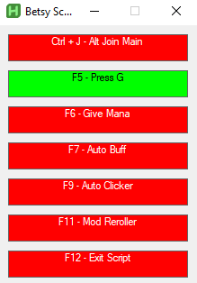
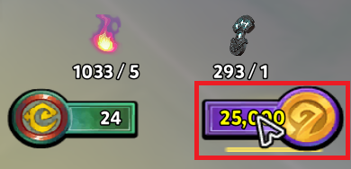

# DD2 Script

AutoHotkey automation script for Dungeon Defenders 2 multi-account management and gameplay assistance.

## Installation

1. Download and install [AutoHotkey v2.0](https://www.autohotkey.com/v2/)
2. Run `Betsy_Script.ahk`

## Update

If you are unfamiliar with Git, You can run the <strong>update.ps1</strong> with powershell to update your files (internet connection required).

## Usage

Press `Ctrl+F1` to open the control GUI with visual status indicators.

### Hotkeys and Functions

**F5 - Press G Loop**
- Press G on every dd2 instances every 5 seconds

**F6 - Give Mana**
- Set "m" shortcut to give all mana for your alts accounts
- Set "l" shorcuts to respawn for your alt accounts

**F7 - Auto Buff**
- Press g on every windows
- Uses spell 3 every 5 seconds

**F9 - Auto Clicker**
- Rapid right-click at currrent mouse position (useful to open shards, boxes, survival chests...)

**F11 - Mod Reroller**

You should hover your mouse over this area before pressing <strong>F11</strong> : \

- Automatically reroll mod until 10
- Stops when "maximum", "achieved", or "OK" detected in center screen region
- Runs up to a maximum of 287 times before it stops 

**F12 - Exit Script**
- Immediately terminates the script

## Window Detection

Script automatically detects:
- Main window: "Dungeon Defenders 2" (excluding alt accounts)
- Alt accounts: Windows titled "[#] Dungeon Defenders 2 [#]"
- All game windows: Any process named "DunDefGame.exe"