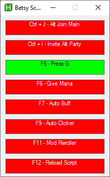

# DD2 Script

AutoHotkey automation script for Dungeon Defenders 2 multi-account management and gameplay assistance.

## Installation

1. Download and install [AutoHotkey v2.0](https://www.autohotkey.com/v2/)
2. Run `Betsy_Script.ahk`

## Update

If you are unfamiliar with Git, You can run the `update.ps1` with powershell to update your files (internet connection required).

## Keys controls

Press `Ctrl+F1` to open the control GUI with visual status indicators.

### Configuration file

Rename file <strong>config.ini.example</strong> by <strong>config.ini</strong>

### Hotkeys and Functions

## Ctrl + J - Alt Join Main account

# config.ini
- In Sandboxie, rename your alt box "<Strong>Steam_1</strong>" (Will be displayed "<strong>Steam 1</strong>" in Sandboxie interface)
- (Optionnal) Fill <strong>SandboxiePath</strong>, if not specified, will take the default Sandboxie Installation Path.
- Fill <strong>SteamInvitelink</strong>.

To find your <strong>Steam invite link</strong> :
1. Run Steam and Dungeon Defenders 2 (you must be in a joinable lobby)
2. Go to your profile
3. Copy paste this link : \

# Usage
1. Main account must be in a joignable lobby
2. Alt account game must be started (can be in menu)
3. Press `Ctrl + J` to make your alt join your lobby

## Ctrl + I - Main account invite alt
# Usage
1. Main account must be in a joignable lobby
2. Only main account and alt in lobby
3. Press `Ctrl + I` to invite your alt to party

**`F5` - Press G Loop**
- Press `g` on every dd2 windows every 5 seconds

**`F6` - Give Mana**
- Bind give all defense mana key to `m` for your alt account
- Bind respawn key to `l` for your alt account

**`F7` - Auto Buff**
- Press `g` on every windows
- Uses spell 3 every 5 seconds on main account window

**`F9` - Auto Clicker**
- Rapid right-click at currrent mouse position (useful to open shards, boxes, survival chests...)

**`F11` - Mod Reroller**

You should hover your mouse over this area before pressing `F11` : \

- Automatically reroll mod until 10
- Stops when "maximum", "achieved", or "OK" detected in center screen region
- Runs up to a maximum of 287 times before it stops 

**`F12` - Exit Script**
- Stop the script

## Window Detection

Script automatically detects:
- Main window: "Dungeon Defenders 2"
- Alt account: Windows titled "[#] Dungeon Defenders 2 [#]"
- All game windows: Any process named "DunDefGame.exe"